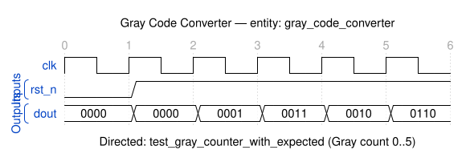

# Quest 5 - Reversing Bits

## Original Problem Statement

### Prompt

Reverse the bits of an input value's binary representation.

### Input and Output Signals

- `din` - Input value
- `dout` - Bitwise reversed value

> [!NOTE]
> For the complete problem description, please visit:
> <https://chipdev.io/question/5>

## Description

Sequential Gray code counter implemented as a binary counter with conversion output.
Each clock cycle increments a binary counter variable, then converts it to Gray code using the standard formula: `gray = count XOR shift_right(count, 1)`.
This produces the characteristic Gray code property where consecutive values differ by only one bit.

---

## Waveform

Timing diagram reconstructed from the entity ports and the example tests in [`tb_gray_code_converter.vhd`](tb_gray_code_converter.vhd).

> [!NOTE]
>
> - WaveDrom source: [`waveforms/waveform.json`](waveforms/waveform.json)
> - Preview/edit live in VS Code with the [Waveform Render](https://marketplace.visualstudio.com/items?itemName=bmpenuelas.waveform-render) extension
> - Re-render: `npx wavedrom-cli -i waveforms/waveform.json -s waveforms/waveform.svg`
> - :warning: Reconstructed diagram may contain mistakes — the testbench is the source of truth

## Source

This quest is from [chipdev.io](https://chipdev.io/question/5).

The problem description above is used under fair use for educational purposes.
For licensing information, see [LICENSE-THIRD-PARTY.md](../../LICENSE-THIRD-PARTY.md).

**Webarchive link:** <https://web.archive.org/web/https://chipdev.io/question/5>
