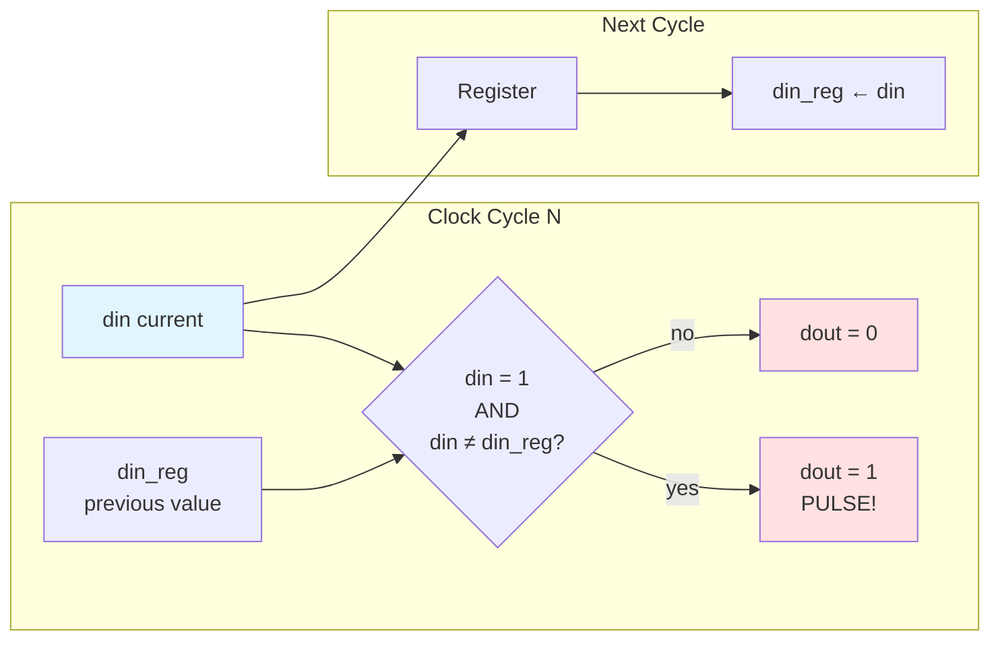

# Quest 6 – Edge Detector

## Original Problem Statement

### Prompt

Build a circuit that pulses `dout` one cycle after the rising edge of `din`. A pulse is defined as writing a single-cycle `1` as shown in the examples below. When `resetn` is asserted, the value of `din` should be treated as `0`.

Bonus - can you enhance your design to pulse `dout` on the same cycle as the rising edge? Note that this enhancement will not pass our test suite, but is still a useful exercise.

### Input and Output Signals

- `clk` - Clock signal
- `resetn` - Synchronous reset-low signal
- `din` - Input signal
- `dout` - Output signal

### Output signals during reset

- `dout` - `0` when `resetn` is active

> [!NOTE]
> For the complete problem description, please visit:
> <https://chipdev.io/question/6>

## Description

Rising edge detector that registers the previous input value each clock cycle and outputs a single-cycle pulse when `din='1'` and differs from the registered value.
The comparison `din /= din_reg` detects the transition, while the `din = '1'` check ensures it's specifically a rising edge.

### Operation Diagram

### Timing Example

```mermaid
%%{init: {'theme':'base'}}%%
gantt
    title Edge Detection Timing
    dateFormat X
    axisFormat %L

    section din
    Low :0, 3
    Rising Edge :milestone, 3, 3
    High :3, 5
    Falling Edge :milestone, 5, 5
    Low :5, 7

    section din_reg
    Low :0, 4
    High :4, 6
    Low :6, 7

    section dout
    Low :0, 4
    Pulse :crit, 4, 5
    Low :5, 7
```

**Detection Logic:** `dout = (din AND (din XOR din_reg))` → True only on 0→1 transition.

---

## Source

This quest is from [chipdev.io](https://chipdev.io/question/6).

The problem description above is used under fair use for educational purposes.
For licensing information, see [LICENSE-THIRD-PARTY.md](../../LICENSE-THIRD-PARTY.md).

**Webarchive link:** <https://web.archive.org/web/https://chipdev.io/question/6>
