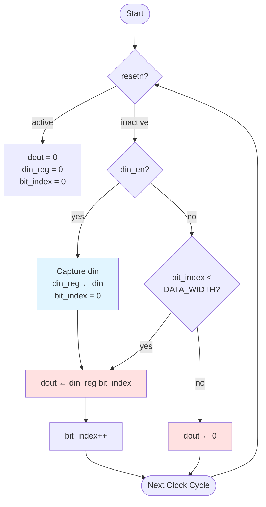

# Quest 7 – Serialiser

## Original Problem Statement

### Prompt

Build a circuit that takes the multi-bit input (`din`) and shifts the input value's least significant bit (rightmost bit) to the single-bit output (`dout`) one bit at a time.

The circuit should begin shifting the input's least significant bit when the the input enable signal (`din_en`) goes high. In other words, the input enable signal going high indicates that this circuit should start shifting the current input signal from it's least significant bit, regardless of which bits the circuit has already shifted.

If all the input's bits have been shifted to the output so that there are no more bits to shift, the output must output `0`.

When reset (`resetn`) is active, the input value that is being shifted is treated as `0`. Even when reset goes back to being inactive, the input value will still be treated as `0`, unless the input enable signal makes the circuit begin shifting from the input again.

### Input and Output Signals

- `clk` - Clock signal
- `resetn` - Synchronous reset-low signal
- `din` - Input signal
- `din_en` - Enable signal for input data
- `dout` - Output signal

### Output signals during reset

- `dout` - `0` when `resetn` is active

> [!NOTE]
> For the complete problem description, please visit:
> <https://chipdev.io/question/7>

> [!NOTE]
> **Implementation Deviation**
>
> This implementation adds a `DATA_WIDTH` generic parameter for configurability, though the original problem doesn't specify a particular bit width.

## Description

Serializer that captures a parallel input word when `din_en` asserts and shifts it out LSB-first over subsequent clock cycles.
A `bit_index` counter tracks which bit to output, incrementing from 0 to `DATA_WIDTH-1`.
The captured data remains in `din_reg` until the entire word is transmitted, then zeros out.

### Operation Diagram

**Timing:**

- Cycle 0: `din_en=1` captures parallel word → outputs bit 0
- Cycle 1-N: Shifts out bits 1 through DATA_WIDTH-1
- Cycle N+1: All bits sent, outputs 0

---

## Source

This quest is from [chipdev.io](https://chipdev.io/question/7).

The problem description above is used under fair use for educational purposes.
For licensing information, see [LICENSE-THIRD-PARTY.md](../../LICENSE-THIRD-PARTY.md).

**Webarchive link:** <https://web.archive.org/web/https://chipdev.io/question/7>
