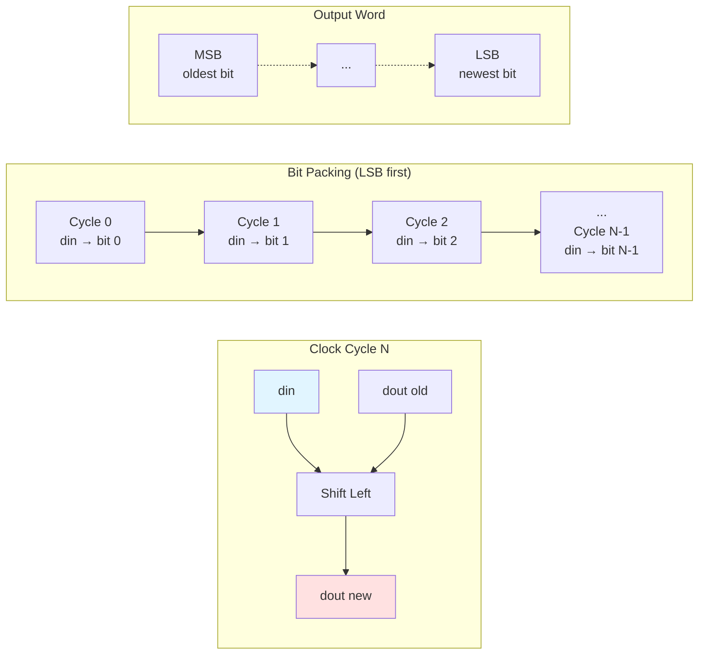

# Quest 8 – Deserialiser

## Original Problem Statement

### Prompt

Build a circuit that reads a sequence of bits (one bit per clock cycle) from the input (`din`), and shifts the bits into the least significant bit of the output (`dout`). Assume all bits of the output are `0` to begin with.

Once the number of input bits received is larger than `DATA_WIDTH`, only the `DATA_WIDTH` most recent bits are kept in the output.

### Input and Output Signals

- `clk` - Clock signal
- `resetn` - Synchronous reset-low signal
- `din` - Input signal
- `dout` - Output signal

### Output signals during reset

- `dout` - `0` when `resetn` is active

> [!NOTE]
> For the complete problem description, please visit:
> <https://chipdev.io/question/8>

> [!NOTE]
> **Implementation Deviation**
>
> This implementation adds a `DATA_WIDTH` generic parameter for configurability, though the original problem doesn't specify a particular bit width.

## Description

Deserialiser that reconstructs a parallel word from serial input.
Each clock cycle shifts the output register left and inserts the new `din` bit at the LSB position using the concatenation `dout <= dout(dout'high - 1 downto 0) & din`.
After `DATA_WIDTH` clock cycles, the complete word appears at the output.

### Operation Diagram



**Shift Register Operation:**

```flow
Cycle 0: dout = 0000_0000, din=1 → dout = 0000_0001
Cycle 1: dout = 0000_0001, din=0 → dout = 0000_0010
Cycle 2: dout = 0000_0010, din=1 → dout = 0000_0101
Cycle 3: dout = 0000_0101, din=0 → dout = 0000_1010
...
```

---

## Source

This quest is from [chipdev.io](https://chipdev.io/question/8).

The problem description above is used under fair use for educational purposes.
For licensing information, see [LICENSE-THIRD-PARTY.md](../../LICENSE-THIRD-PARTY.md).

**Webarchive link:** <https://web.archive.org/web/https://chipdev.io/question/8>
