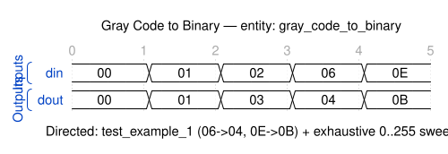

# Quest 11 – Gray Code to Binary

## Original Problem Statement

### Prompt

Given a value, output its index in the standard Gray code sequence. This is known as converting a Gray code value to binary.

Each input value's binary representation is an element in the Gray code sequence, and your circuit should output the index of the Gray code sequence the input value corresponds to.

In the standard encoding the least significant bit follows a repetitive pattern of 2 on, 2 off ( `... 11001100 ...` ); the next digit a pattern of 4 on, 4 off ( `... 1111000011110000 ...` ); the nth least significant bit a pattern of 2� on 2� off.

### Input and Output Signals

- `gray` - Input signal, interpreted as an element of the Gray code sequence
- `bin` - Index of the Gray code sequence the input corresponds to

> [!NOTE]
> For the complete problem description, please visit:
> <https://chipdev.io/question/11>

## Description

Gray-to-binary decoder using iterative XOR reduction.
Starting with the Gray code input, it repeatedly XORs the current value with itself right-shifted by 1, accumulating the result.
The loop continues until the mask (shifted value) becomes zero.
This implements the standard conversion where each binary bit equals the XOR of all Gray code bits from that position to the MSB.

---

## Waveform

Timing diagram reconstructed from the entity ports and the example tests in [`tb_gray_code_to_binary.vhd`](tb_gray_code_to_binary.vhd).

> [!NOTE]
>
> - WaveDrom source: [`waveforms/waveform.json`](waveforms/waveform.json)
> - Preview/edit live in VS Code with the [Waveform Render](https://marketplace.visualstudio.com/items?itemName=bmpenuelas.waveform-render) extension
> - Re-render: `npx wavedrom-cli -i waveforms/waveform.json -s waveforms/waveform.svg`
> - :warning: Reconstructed diagram may contain mistakes — the testbench is the source of truth

## Source

This quest is from [chipdev.io](https://chipdev.io/question/11).

The problem description above is used under fair use for educational purposes.
For licensing information, see [LICENSE-THIRD-PARTY.md](../../LICENSE-THIRD-PARTY.md).

**Webarchive link:** <https://web.archive.org/web/https://chipdev.io/question/11>
