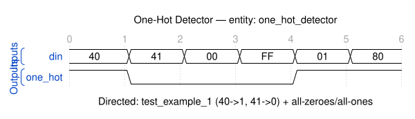

# Quest 13 – One-Hot Detector

## Original Problem Statement

### Prompt

One-hot values have a single bit that is a `1` with all other bits being `0`. Output a `1` if the input (`din`) is a one-hot value, and output a `0` otherwise.

### Input and Output Signals

- `din` - Input value
- `onehot` - `1` if the input is a one-hot value and `0` otherwise

> [!NOTE]
> For the complete problem description, please visit:
> <https://chipdev.io/question/13>

## Description

Validates one-hot encoding by checking if exactly one bit is set.
Uses the `is_one_hot()` utility function which returns true only when the input contains a single '1' bit with all others '0'.
Common in FSM state encodings and bus arbitration where mutual exclusion is required.

---

## Waveform

Timing diagram reconstructed from the entity ports and the example tests in [`tb_one_hot_detector.vhd`](tb_one_hot_detector.vhd).

> [!NOTE]
>
> - WaveDrom source: [`waveforms/waveform.json`](waveforms/waveform.json)
> - Preview/edit live in VS Code with the [Waveform Render](https://marketplace.visualstudio.com/items?itemName=bmpenuelas.waveform-render) extension
> - Re-render: `npx wavedrom-cli -i waveforms/waveform.json -s waveforms/waveform.svg`
> - :warning: Reconstructed diagram may contain mistakes — the testbench is the source of truth

## Source

This quest is from [chipdev.io](https://chipdev.io/question/13).

The problem description above is used under fair use for educational purposes.
For licensing information, see [LICENSE-THIRD-PARTY.md](../../LICENSE-THIRD-PARTY.md).

**Webarchive link:** <https://web.archive.org/web/https://chipdev.io/question/13>
