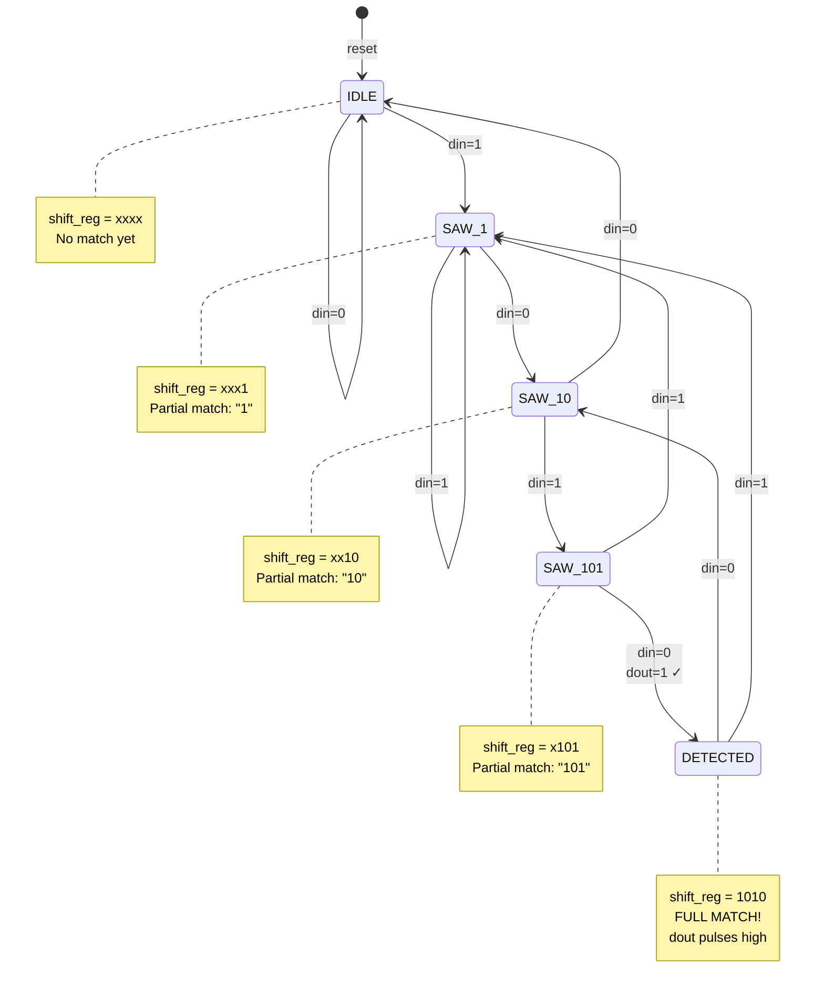

# Quest 15 – Sequence Detector

## Original Problem Statement

### Prompt

Given a stream of input bits, pulse a `1` on the output (`dout`) whenever a `b1010` sequence is detected on the input (`din`).

When the reset-low signal (`resetn`) goes active, all previously seen bits on the input are no longer considered when searching for `b1010`.

### Input and Output Signals

- `clk` - Clock signal
- `resetn` - Synchronous reset-low signal
- `din` - Input bits
- `dout` - `1` if a `b1010` was detected, `0` otherwise

### Output signals during reset

- `dout` - `0` when `resetn` is active

> [!NOTE]
> For the complete problem description, please visit:
> <https://chipdev.io/question/15>

## Description

Parameterizable sequence detector using a shift register matched against a constant pattern.
Each clock shifts the serial input `din` into the register, with the code handling both ascending and descending bit orderings via compile-time selection.
Detection pulses high when the shift register contents exactly match `SEQUENCE_PATTERN`.

### State Diagram (for pattern "1010")

**Implementation:** Shift register continuously shifts `din` in, comparator checks if register equals `SEQUENCE_PATTERN` ("1010").

---

## Source

This quest is from [chipdev.io](https://chipdev.io/question/15).

The problem description above is used under fair use for educational purposes.
For licensing information, see [LICENSE-THIRD-PARTY.md](../../LICENSE-THIRD-PARTY.md).

**Webarchive link:** <https://web.archive.org/web/https://chipdev.io/question/15>
