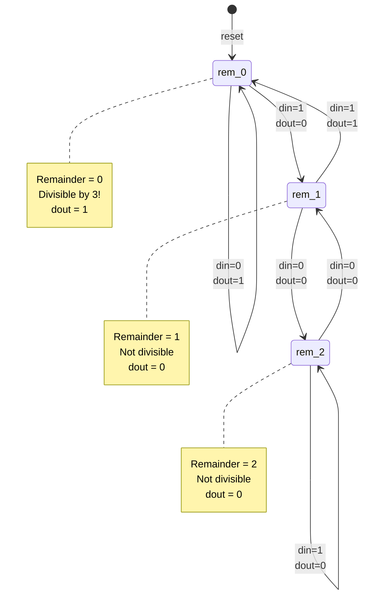

# Quest 16 – Divisible by 3

## Original Problem Statement

### Prompt

Design a circuit that determines whether an input value is evenly divisible by three.

The input value is of unknown length and is left-shifted one bit at a time into the circuit via the input (`din`). The circuit should output a `1` on the output (`dout`) if the current cumulative value is evenly divisible by three, and a `0` otherwise.

When `resetn` is asserted, all previous bits seen on the input are no longer considered. The `0` seen during reset should not be included when calculating the next value.

This problem is tricky, so it may help to think in terms of modulus and remainder states.

### Input and Output Signals

- `clk` - Clock signal
- `resetn` - Synchronous reset-low signal
- `din` - Input bit
- `dout` - `1` if the current value is divisible by `3`, `0` otherwise

### Output signals during reset

- `dout` - `0` when `resetn` is asserted

> [!NOTE]
> For the complete problem description, please visit:
> <https://chipdev.io/question/16>

## Description

Bitwise divisibility-by-3 detector using modular arithmetic FSM.
Exploits the property that powers of 2 modulo 3 alternate between 1 and 2 (2^0≡1, 2^1≡2, 2^2≡1...).
The state machine tracks remainder {0,1,2} as each bit arrives, with state transitions encoding how each bit contributes to the running modulo-3 sum.
Divisible when final state is `rem_0`.

### State Diagram

**State Transition Logic:**

- When `din=0`: Left-shift the value (multiply by 2)
  - rem_0 → rem_0: `(0×2) mod 3 = 0`
  - rem_1 → rem_2: `(1×2) mod 3 = 2`
  - rem_2 → rem_1: `(2×2) mod 3 = 1`
- When `din=1`: Left-shift and add 1 (multiply by 2, add 1)
  - rem_0 → rem_1: `(0×2+1) mod 3 = 1`
  - rem_1 → rem_0: `(1×2+1) mod 3 = 0`
  - rem_2 → rem_2: `(2×2+1) mod 3 = 2`

---

## Source

This quest is from [chipdev.io](https://chipdev.io/question/16).

The problem description above is used under fair use for educational purposes.
For licensing information, see [LICENSE-THIRD-PARTY.md](../../LICENSE-THIRD-PARTY.md).

**Webarchive link:** <https://web.archive.org/web/https://chipdev.io/question/16>
