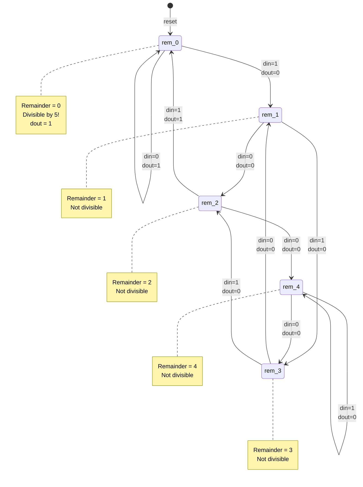

# Quest 17 – Divisible by 5

## Original Problem Statement

### Prompt

Design a module that determines whether an input value is evenly divisible by five.

The input value is of unknown length and is left-shifted one bit at a time into the module via the input (`din`). The module should output a `1` on the output (`dout`) if the current cumulative value is evenly divisible by five and a `0` otherwise.

When `resetn` is asserted, all previous bits seen on the input are no longer considered. The `0` seen during reset should not be included when calculating the next value.

This problem is tricky, so it may help to think in terms of modulus and remainder states.

### Input and Output Signals

- `clk` - Clock signal
- `resetn` - Synchronous reset-low signal
- `din` - Input bit
- `dout` - `1` if the current value is divisible by `5`, `0` otherwise

### Output signals during reset

- `dout` - `0` when `resetn` is active

> [!NOTE]
> For the complete problem description, please visit:
> <https://chipdev.io/question/17>

## Description

Bitwise divisibility-by-5 detector using modular arithmetic FSM.
Powers of 2 modulo 5 cycle as {1,2,4,3,1...}, which the state machine tracks across five remainder states {0,1,2,3,4}.
Each input bit transitions the state according to its positional contribution modulo 5.
Divisible when final state is `rem_0`.

### State Diagram

**Powers of 2 mod 5 cycle:** {1, 2, 4, 3, 1, 2, 4, 3, ...}

- 2^0 mod 5 = 1
- 2^1 mod 5 = 2
- 2^2 mod 5 = 4
- 2^3 mod 5 = 3
- 2^4 mod 5 = 1 (cycle repeats)

---

## Source

This quest is from [chipdev.io](https://chipdev.io/question/17).

The problem description above is used under fair use for educational purposes.
For licensing information, see [LICENSE-THIRD-PARTY.md](../../LICENSE-THIRD-PARTY.md).

**Webarchive link:** <https://web.archive.org/web/https://chipdev.io/question/17>
