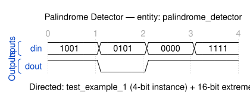

# Quest 18 - Palindrome Detector

## Original Problem Statement

### Prompt

Given an input (`din`), output (`dout`) a `1` if its binary representation is a palindrome and a `0` otherwise.

A palindrome binary representation means that the binary representation has the same sequence of bits whether you read it from left to right or right to left. Leading `0`s are considered part of the input binary representation.

### Input and Output Signals

- `din` - Input value
- `dout` - `1` if the binary representation is a palindrome, `0` otherwise

> [!NOTE]
> For the complete problem description, please visit:
> <https://chipdev.io/question/18>

## Description

Palindrome detector that reverses the input vector via a generate loop assigning `din_reversed(i) <= din(i)` with reversed range declaration.
The equality comparison `din = din_reversed` then determines if the bit pattern is symmetric. Pure combinational logic.

---

## Waveform

Timing diagram reconstructed from the entity ports and the example tests in [`tb_palindrome_detector.vhd`](tb_palindrome_detector.vhd).

> [!NOTE]
>
> - WaveDrom source: [`waveforms/waveform.json`](waveforms/waveform.json)
> - Preview/edit live in VS Code with the [Waveform Render](https://marketplace.visualstudio.com/items?itemName=bmpenuelas.waveform-render) extension
> - Re-render: `npx wavedrom-cli -i waveforms/waveform.json -s waveforms/waveform.svg`
> - :warning: Reconstructed diagram may contain mistakes � the testbench is the source of truth

## Source

This quest is from [chipdev.io](https://chipdev.io/question/18).

The problem description above is used under fair use for educational purposes.
For licensing information, see [LICENSE-THIRD-PARTY.md](../../LICENSE-THIRD-PARTY.md).

**Webarchive link:** <https://web.archive.org/web/https://chipdev.io/question/18>
