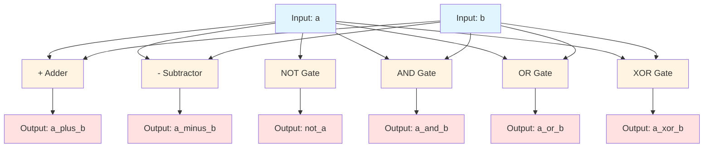

# Quest 23 – Basic ALU

## Original Problem Statement

### Prompt

Design a simple Arithmetic Logic Unit (ALU) which performs a set of operations on two input operands `a` and `b`. The outputs of each operation are sent to the corresponding output signal - `a_plus_b`, `a_minus_b`, `not_a`, `a_and_b`, `a_or_b`, and `a_xor_b`.

The ALU is an important part of many modern computing systems. Conventional ALUs receive two operands from an external control unit, as well as an opcode which determines the type of calculation to perform. For this question, we've simplified the behavior such that the ALU produces all outputs at once.

### Input and Output Signals

- `a` - First operand input
- `b` - Second operand input
- `a_plus_b` - Output `a` plus `b`
- `a_minus_b` - Output `a` minus `b`
- `not_a` - Output not `a` (ones complement)
- `a_and_b` - Output `a` bitwise-and `b`
- `a_or_b` - Output `a` bitwise-or `b`
- `a_xor_b` - Output `a` exclusive-or `b`

> [!NOTE]
> For the complete problem description, please visit:
> <https://chipdev.io/question/23>

## Description

Combinational ALU providing six parallel operations: addition, subtraction, NOT, AND, OR, and XOR.
All operations compute concurrently on the same inputs with results appearing at separate output ports.
The `resize()` function handles overflow saturation for arithmetic operations.

### Architecture Diagram

**Key Feature:** All operations execute in parallel (combinational logic only).

---

## Source

This quest is from [chipdev.io](https://chipdev.io/question/23).

The problem description above is used under fair use for educational purposes.
For licensing information, see [LICENSE-THIRD-PARTY.md](../../LICENSE-THIRD-PARTY.md).

**Webarchive link:** <https://web.archive.org/web/https://chipdev.io/question/23>
