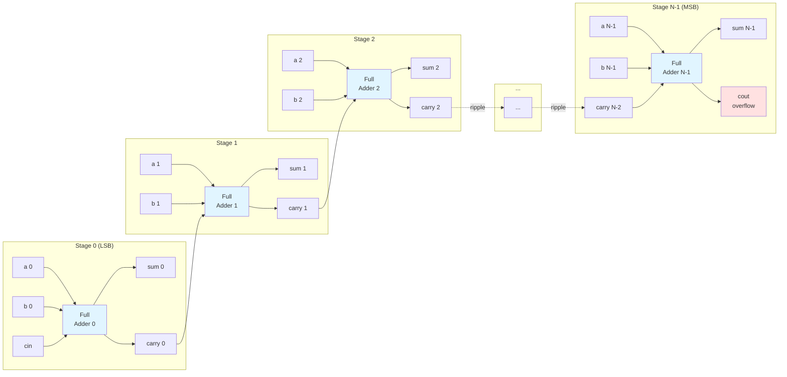

# Quest 24 – Ripple Carry Adder

## Original Problem Statement

### Prompt

A Ripple Carry Adder (RCA) is a multi-bit addition circuit composed of a number of cascaded full adders (FAs). In an RCA, the carry-out bit of stage i is propagated to the carry-in port, `cin`, of stage i+1 so that the carry bit ripples through the entire chain of FAs, from the least significant bit (LSB) to the most significant bit (MSB).

Use the solution to question 22 (Full Adder) and implement a flexible data width RCA. The RCA module takes two integers `a` and `b`, and produces two output words `sum` and `cout_fa1`. Output `cout_fa1` corresponds to the carry-out nets of each FA stage.

Important: This question must be solved using a multimodule approach. That is, there must be a module for a single-bit FA that is instantiated `DATA_WIDTH` times in order to build a multi-bit RCA. You will be able to use the solution to question 22 (Full Adder) as the single-bit FA module.

### Input and Output Signals

- `a` - First operand input word
- `b` - Second operand input word
- `sum` - Output word corresponding to a plus b operation (note that sum has DATA_WIDTH+1 bits to account for the carry-out/overflow bit)
- `cout_int` - Internal carry-out nets, ouputs of the full adder instances

> [!NOTE]
> For the complete problem description, please visit:
> <https://chipdev.io/question/24>

## Description

Ripple-carry adder built from a chain of full adder instances.
A generate loop instantiates DATA_WIDTH full adders, with each stage's carry-out feeding the next stage's carry-in.
The first stage uses the external `cin` input.
Exposes internal carry signals via `cout_int` for use in advanced adder topologies like carry-select adders.

### Architecture Diagram

**Carry Propagation:** Each stage must wait for the previous stage's carry before computing its result.
**Critical Path:** Carry ripples through all stages from LSB to MSB.

---

## Source

This quest is from [chipdev.io](https://chipdev.io/question/24).

The problem description above is used under fair use for educational purposes.
For licensing information, see [LICENSE-THIRD-PARTY.md](../../LICENSE-THIRD-PARTY.md).

**Webarchive link:** <https://web.archive.org/web/https://chipdev.io/question/24>
