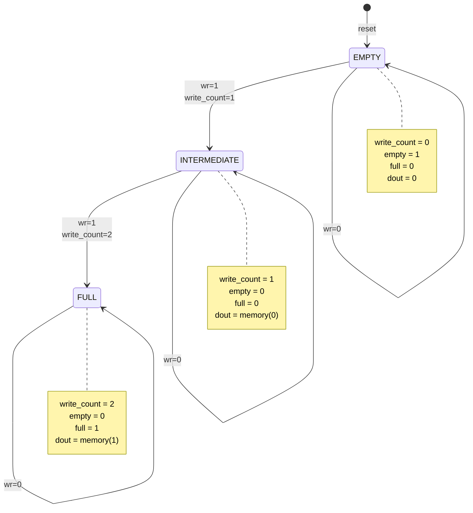
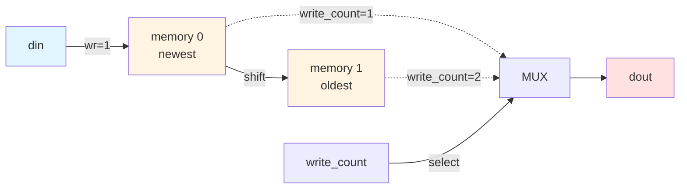

# Quest 26 – Multi-Bit FIFO

## Original Problem Statement

### Prompt

Design a multi-bit First In First Out (FIFO) circuit. The FIFO includes two entries of size `DATA_WIDTH` and requires zero output latency.

Upon assertion of `resetn` (active-low), the FIFO is reset to zero and the `empty` signal is set to logic high to indicate the FIFO is empty. Once `resetn` is unpressed, the operation starts. The FIFO has a two-entry bank of flip-flops that can be written to by using inputs `din` (data in) and `wr` (write-enable). If `wr` is set to logic low, the input `din` does not get written to the FIFO.

As the FIFO is being written to, its output port `dout` should imediatelly reflect the first-in data, i.e., there should be no latency between inputs and outputs. Once all entries are written to, the FIFO should output `full = 1` in order to indicate it is full. Writing to a full FIFO is a valid operation and the output `full` must be set to one.

Important: There are at least three possible states in this design: (1) Empty; (2) Intermediate; (3) Full. Whenever the FIFO is reset, it transitions to state (1). As the entries are updated, the state switches from (1) to (2), and finally from (2) to (3), once completely filled. Use a mux to direct the intermediate stages of the FIFO to the output port `dout` to achieve a low latency design.

### Input and Output Signals

- `clk` - Clock signal
- `resetn` - Active-low, reset signal
- `din` - FIFO input data
- `wr` - Active-high, write signal
- `dout` - FIFO output data
- `full` - Full FIFO indicator
- `empty` - Empty FIFO indicator

### Output signals during reset

- `dout` - 0
- `full` - 0
- `empty` - 1

> [!NOTE]
> For the complete problem description, please visit:
> <https://chipdev.io/question/26>

## Description

Two-deep shift-register FIFO. Each write shifts all entries up by one position and inserts new data at index 0.
The `write_count` variable tracks occupancy (0=empty, 1=one entry, 2=full).
Output comes from `memory(write_count - 1)`, always pointing to the oldest entry.
The array range extends to -1 to avoid indexing errors when evaluating expressions in the empty state.

### State Diagram

### Data Flow

**Zero-latency design:** Output `dout` directly reflects the oldest entry via multiplexer, not registered.

---

## Source

This quest is from [chipdev.io](https://chipdev.io/question/26).

The problem description above is used under fair use for educational purposes.
For licensing information, see [LICENSE-THIRD-PARTY.md](../../LICENSE-THIRD-PARTY.md).

**Webarchive link:** <https://web.archive.org/web/https://chipdev.io/question/26>
