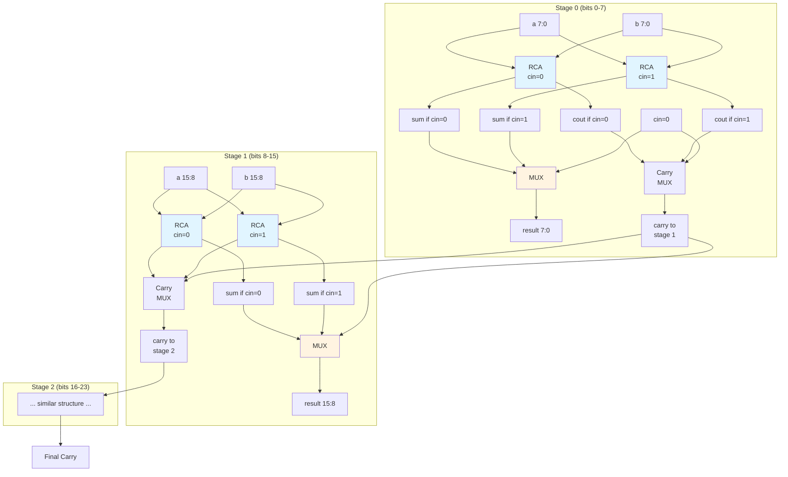

# Quest 32 – Carry-Select Adder

## Original Problem Statement

### Prompt

Use the solutions to questions 22 & 24 (Full Adder and Ripper Carry Adder, respectively) to implement a 24-bit Carry Select Adder (CSA). CSAs commonly employ two Ripple Carry Adders (RCAs) which compute `a + b + cin`, where `cin = 0` in one computation, and `cin = 1` in the other. The final result is obtained by selecting the correct partial sum, based on the `cout` bit of the previous stage.

In this question, implement a 24-bit Carry Select Adder (CSA) using multiple parallel RCAs and multiplexers. The CSA module takes two unsigned integers `a` and `b`, and produces an output word `sum`, corresponding to `a + b` operation. The number of RCA stages in the CSA can be chosen by the designer, e.g., 3 stages of 8-bit RCAs, 4 stages of 6-bit RCAs, etc. Bonus: Can you design a parametric number of stage 24-bit CSA? Test your design with various number of RCA stages.

### Input and Output Signals

- `a` - First operand input word
- `b` - Second operand input word
- `result` - Output word corresponding to a plus b operation (25-bit word since both a and b are 24-bit)

> [!NOTE]
> For the complete problem description, please visit:
> <https://chipdev.io/question/33>
>
> Note: This is Quest 32 in the repository (chipdev.io is missing Quest #27)

## Description

Carry-select adder dividing the operands into `STAGES` blocks plus an optional remainder stage.
Each stage instantiates two ripple-carry adders computing results for both carry-in possibilities (0 and 1).
A multiplexer chain selects the correct sum based on the actual carry from the previous stage.
When `DATA_WIDTH` doesn't divide evenly by `STAGES`, remaining bits form an additional stage.
This architecture trades area for reduced carry propagation delay compared to pure ripple-carry.

### Architecture Diagram

**Key Advantage:** Stages compute in parallel, then quickly select correct result based on previous carry.
**Critical Path:** One RCA delay + (STAGES × MUX delay) vs. full ripple of DATA_WIDTH stages.

---

## Source

This quest is from [chipdev.io](https://chipdev.io/question/33).

The problem description above is used under fair use for educational purposes.
For licensing information, see [LICENSE-THIRD-PARTY.md](../../LICENSE-THIRD-PARTY.md).

**Webarchive link:** <https://web.archive.org/web/https://chipdev.io/question/33>
