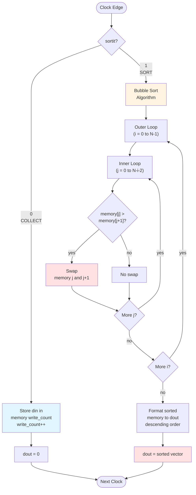

# Quest 33 – Bubble Sort

## Original Problem Statement

### Prompt

Design a module that implements the bubble sort algorithm within one cycle. The module takes three inputs: `din`, which corresponds to a `BITWIDTH`-bit unsigned word; `sortit`, a 1-bit signal that is asserted in order to start a new sort operation; and `resetn`, a synchronous, active-low reset signal. The module's output is a `(8*BITWIDTH+1)`-bit unsigned bitstream that corresponds to a sorted vector of `(8*BITWIDTH)` unsigned words, which were stored in the module's memory when the input `sortit` is asserted.

Input `sortit` is an asynchronous signal, coming from another module. Assume there's no need to flop it. Inputs are registered only when `sortit = 0` and ignored otherwise. Output `dout` is valid only when `sortit = 1`. That is, the sorted vector is produced only when `sortit = 1`, or else `dout` is expected to produce zero. The output vector is sorted in a descending order. The `BITWIDTH` most significant bits correpond to the smallest value whereas the `BITWIDTH` least significant bits correspond to the largest value.

### Input and Output Signals

- `din` - Unsigned data input word
- `sortit` - Sort input bit
- `clk` - Clock signal
- `resetn` - Synchronous, active low, reset signal
- `dout` - Output word corresponding to the sorted, concantenated memory-stored values when sortit is asserted

### Output signals during reset

- `dout` - 0

> [!NOTE]
> For the complete problem description, please visit:
> <https://chipdev.io/question/34>
>
> Note: This is Quest 33 in the repository (chipdev.io is missing Quest #27)

## Description

Hardware bubble sort collecting VECTOR_SIZE elements then sorting when `sortit` asserts.
During collection phase, incoming data fills a memory array via a wrapping counter.
When triggered, the `bubble_sorter` function performs nested-loop comparisons, swapping adjacent elements when out of order.
The sorted result is reformatted with the largest value in the MSBs via `get_sorted_vector`.
`O(n^2)` time complexity executed combinationally within one clock cycle.

### Operation Flowchart

**Key Points:**

- Collection: `sortit=0` → accumulate 8 input values
- Sorting: `sortit=1` → perform O(n²) bubble sort in **one clock cycle** (combinational)
- Output: Sorted in descending order (largest value in MSBs)

---

## Source

This quest is from [chipdev.io](https://chipdev.io/question/34).

The problem description above is used under fair use for educational purposes.
For licensing information, see [LICENSE-THIRD-PARTY.md](../../LICENSE-THIRD-PARTY.md).

**Webarchive link:** <https://web.archive.org/web/https://chipdev.io/question/34>
