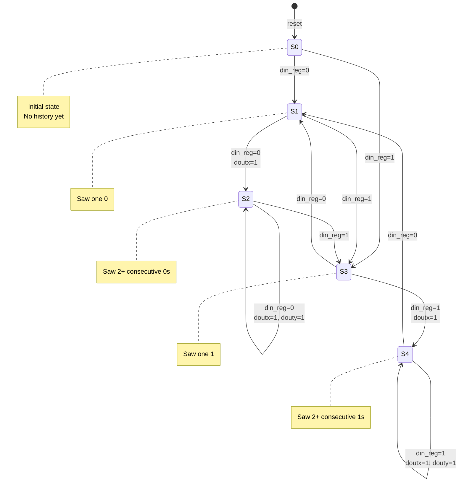

# Quest 34 – Mealy Finite State Machine

## Original Problem Statement

### Prompt

In this question, design a Mealy Finite State Machine (FSM) that has five states, `S0`-`S4`. Upon `resetn` logic low, the FSM resets and current state becomes `S0`. The inputs `din` and `cen` are registered inside the module, therefore, their registers also reset to zero.

When `resetn = 1`, the FSM starts its operation. `doutx` must produce one whenever the current cycle `din` as well as the previous cycle `din` have the same values. Similarly, `douty` must output one whenever the current cycle `din` is the same now as it was for the past two cycles. Input `cen` (the registered version of it, inside the module) is used to gate the output. That is, in a particular cycle, if `cen = 0`, then outputs `doutx` and `douty` are both zero.

Try to solve this question using a textbook Mealy FSM approach. Sketch the state diagrams with the five possible state and the allowed transitions between them.

### Input and Output Signals

- `clk` - Clock signal
- `resetn` - Synchronous, active low, reset signal
- `cen` - Chip enable
- `din` - 1-bit input a
- `doutx` - 1-bit output x
- `douty` - 1-bit output y

### Output signals during reset

- `doutx` - 0
- `douty` - 0

> [!NOTE]
> For the complete problem description, please visit:
> <https://chipdev.io/question/35>
>
> Note: This is Quest 34 in the repository (chipdev.io is missing Quest #27)

## Description

Mealy finite state machine with outputs depending on both current state and inputs.
Five states track input history: S0 (initial), S1/S2 (saw zeros), S3/S4 (saw ones).
The `din_reg` and `cen_reg` signals capture inputs synchronously to avoid combinational timing issues.
Output `doutx` pulses when receiving consecutive matching bits (00 or 11), while `douty` requires at least two previous matching bits.
Both outputs gate through `cen_reg` for external enable control.

### State Diagram

**Output Logic:**

- `doutx = 1` when two consecutive matching bits (shown on transitions)
- `douty = 1` when three consecutive matching bits (only in S2/S4)
- Both outputs gated by `cen_reg`

---

## Source

This quest is from [chipdev.io](https://chipdev.io/question/35).

The problem description above is used under fair use for educational purposes.
For licensing information, see [LICENSE-THIRD-PARTY.md](../../LICENSE-THIRD-PARTY.md).

**Webarchive link:** <https://web.archive.org/web/https://chipdev.io/question/35>
